# Provisum -- Entity Relationship Diagram

**Generated:** 2026-03-30 | **Schema source:** `db/schema.ts` | **Tables:** 39+

---

## How to render

This diagram uses [Mermaid](https://mermaid.js.org/) syntax. View it in:
- GitHub (renders natively in `.md` files)
- VS Code with the Mermaid extension
- [mermaid.live](https://mermaid.live) (paste the code block)

---

## Full ER Diagram

```mermaid
erDiagram

    %% ===== ORGANIZATIONAL HIERARCHY =====

    org_units {
        serial id PK
        text name
        text level "L1, L2, L3"
        integer parent_id FK "self-ref"
        text description
    }

    %% ===== SOURCE SYSTEM DATA =====

    users {
        serial id PK
        text source_user_id UK
        text display_name
        text email
        text department
        text job_title
        text org_unit
        integer org_unit_id FK
        text cost_center
        text user_type
        text metadata
        text created_at
        text updated_at
    }

    source_roles {
        serial id PK
        text role_id UK
        text role_name
        text description
        text system
        text domain
        text role_type
        text role_owner
        text created_at
    }

    source_permissions {
        serial id PK
        text permission_id UK
        text permission_name
        text description
        text system
        text permission_type
        text risk_level
    }

    source_role_permissions {
        serial id PK
        integer source_role_id FK
        integer source_permission_id FK
    }

    user_source_role_assignments {
        serial id PK
        integer user_id FK
        integer source_role_id FK
        text assigned_date
    }

    %% ===== PERSONAS (AI-generated or manual) =====

    consolidated_groups {
        serial id PK
        text name UK
        text description
        text access_level
        text domain
        integer sort_order
        text created_at
    }

    personas {
        serial id PK
        text name UK
        text description
        text business_function
        integer consolidated_group_id FK
        text source "ai | manual | hris_import"
        boolean is_active
        text created_at
        text updated_at
    }

    persona_source_permissions {
        serial id PK
        integer persona_id FK
        integer source_permission_id FK
        real weight
        boolean is_required
    }

    user_persona_assignments {
        serial id PK
        integer user_id FK
        integer persona_id FK
        integer consolidated_group_id FK
        real confidence_score
        text ai_reasoning
        text ai_model
        text assignment_method
        integer job_run_id FK
        text created_at
        text updated_at
    }

    persona_confirmations {
        serial id PK
        integer org_unit_id FK
        text confirmed_at
        integer confirmed_by FK
        text reset_at
        integer reset_by FK
        text created_at
    }

    %% ===== TARGET SYSTEM DATA =====

    target_roles {
        serial id PK
        text role_id UK
        text role_name
        text description
        text system
        text domain
        text capabilities
        text role_owner
        text created_at
    }

    target_permissions {
        serial id PK
        text permission_id UK
        text permission_name
        text description
        text system
        text permission_type
        text risk_level
    }

    target_task_roles {
        serial id PK
        text task_role_id UK
        text task_role_name
        text description
        text system
        text domain
        text created_at
    }

    target_task_role_permissions {
        serial id PK
        integer target_task_role_id FK
        integer target_permission_id FK
    }

    target_security_role_tasks {
        serial id PK
        integer target_role_id FK
        integer target_task_role_id FK
    }

    target_role_permissions {
        serial id PK
        integer target_role_id FK
        integer target_permission_id FK
    }

    %% ===== MAPPING & ASSIGNMENTS =====

    persona_target_role_mappings {
        serial id PK
        integer persona_id FK
        integer target_role_id FK
        text mapping_reason
        real coverage_percent
        real excess_percent
        text confidence
        boolean is_active
        text created_at
    }

    user_target_role_assignments {
        serial id PK
        integer user_id FK
        integer target_role_id FK
        integer release_id FK
        integer derived_from_persona_id FK
        text assignment_type
        text status "draft | pending_review | approved | ..."
        text release_phase
        integer sod_conflict_count
        text risk_accepted_by
        text approved_by
        text mapped_by
        text created_at
        text updated_at
    }

    %% ===== SOD (Segregation of Duties) =====

    sod_rules {
        serial id PK
        text rule_id UK
        text rule_name
        text description
        text permission_a
        text permission_b
        text severity
        text risk_description
        boolean is_active
        text created_at
    }

    sod_conflicts {
        serial id PK
        integer user_id FK
        integer sod_rule_id FK
        integer role_id_a FK
        integer role_id_b FK
        text permission_id_a
        text permission_id_b
        text severity
        text conflict_type
        text resolution_status
        text resolved_by
        text resolution_notes
        integer analysis_job_id FK
        text created_at
    }

    %% ===== RELEASES (migration waves) =====

    releases {
        serial id PK
        text name
        text description
        text status
        text release_type
        text target_system
        text target_date
        text mapping_deadline
        text review_deadline
        text approval_deadline
        boolean is_active
        text created_by
        text created_at
        text updated_at
    }

    release_users {
        serial id PK
        integer release_id FK
        integer user_id FK
        text added_at
    }

    release_org_units {
        serial id PK
        integer release_id FK
        integer org_unit_id FK
        text added_at
    }

    release_source_roles {
        serial id PK
        integer release_id FK
        integer source_role_id FK
        text added_at
    }

    release_target_roles {
        serial id PK
        integer release_id FK
        integer target_role_id FK
        text added_at
    }

    release_sod_rules {
        serial id PK
        integer release_id FK
        integer sod_rule_id FK
        text added_at
    }

    %% ===== APP USERS (platform users) =====

    app_users {
        serial id PK
        text username UK
        text display_name
        text email
        text password_hash
        text role "system_admin | admin | mapper | ..."
        integer assigned_org_unit_id FK
        boolean is_active
        integer failed_login_attempts
        text supabase_auth_id UK
        text created_at
        text updated_at
    }

    app_user_sessions {
        serial id PK
        text session_token UK
        integer app_user_id FK
        text expires_at
        text created_at
    }

    app_user_releases {
        serial id PK
        integer app_user_id FK
        integer release_id FK
        text assigned_at
    }

    user_invites {
        serial id PK
        integer app_user_id FK
        text token UK
        text email
        text status "pending | accepted | expired"
        text expires_at
        text created_at
    }

    work_assignments {
        serial id PK
        integer app_user_id FK
        text assignment_type
        text scope_type
        text scope_value
        text created_at
    }

    %% ===== NOTIFICATIONS =====

    notifications {
        serial id PK
        integer from_user_id FK
        integer to_user_id FK
        text notification_type
        text subject
        text message
        text related_entity_type
        integer related_entity_id
        text action_url
        text status
        text created_at
    }

    %% ===== PROVISIONING & GAPS =====

    least_access_exceptions {
        serial id PK
        integer persona_id FK
        integer target_role_id FK
        real excess_percent
        text justification
        text accepted_by
        text status
        text created_at
    }

    permission_gaps {
        serial id PK
        integer persona_id FK
        integer source_permission_id FK
        text gap_type
        text notes
        text created_at
    }

    security_design_changes {
        serial id PK
        integer target_role_id FK
        text change_type
        text change_description
        text detected_at
        integer affected_mapping_count
        text acknowledged_by
        text created_at
    }

    %% ===== JOBS & AUDIT =====

    processing_jobs {
        serial id PK
        text job_type
        text status
        integer total_records
        integer processed
        integer failed
        text config
        text error_log
        text started_at
        text completed_at
        text created_at
    }

    audit_log {
        serial id PK
        text entity_type
        integer entity_id
        text action
        text old_value
        text new_value
        text actor_email
        text ip_address
        text metadata
        text created_at
    }

    review_links {
        serial id PK
        text token UK
        integer created_by FK
        text expires_at
        text created_at
    }

    %% ===== SYSTEM CONFIG =====

    system_settings {
        serial id PK
        text key UK
        text value
        text updated_at
        text updated_by
    }

    feature_flags {
        serial id PK
        text key UK
        text description
        boolean enabled
        text enabled_for_roles "JSON"
        text enabled_for_users "JSON"
        integer percentage
        text metadata "JSON"
        text created_at
        text updated_at
    }

    rate_limit_entries {
        serial id PK
        text key
        integer count
        text window_start
        text window_end
    }

    %% ===== WEBHOOKS =====

    webhook_endpoints {
        serial id PK
        text url
        text description
        text secret
        text events "JSON"
        boolean enabled
        integer failure_count
        text created_at
    }

    webhook_deliveries {
        serial id PK
        integer endpoint_id FK
        text event_type
        text payload "JSON"
        text status
        integer http_status
        integer attempts
        text created_at
    }

    %% ===== SCHEDULED EXPORTS =====

    scheduled_exports {
        serial id PK
        text name
        text export_type
        text schedule
        integer day_of_week
        integer day_of_month
        integer hour
        boolean enabled
        text last_run_at
        text last_run_status
        integer created_by FK
        text created_at
    }

    %% ===== CHAT (Lumen) =====

    chat_conversations {
        serial id PK
        integer user_id FK
        text title
        text messages "JSON"
        integer message_count
        text last_message_at
        text created_at
    }

    %% ═══════════════════════════════════════════
    %% RELATIONSHIPS
    %% ═══════════════════════════════════════════

    %% Org hierarchy (self-referencing)
    org_units ||--o{ org_units : "parent/child"

    %% Users -> Org Units
    users }o--|| org_units : "belongs to"

    %% Source system relationships
    source_roles ||--o{ source_role_permissions : "has"
    source_permissions ||--o{ source_role_permissions : "has"
    users ||--o{ user_source_role_assignments : "has"
    source_roles ||--o{ user_source_role_assignments : "assigned via"

    %% Persona relationships
    consolidated_groups ||--o{ personas : "groups"
    personas ||--o{ persona_source_permissions : "has"
    source_permissions ||--o{ persona_source_permissions : "included in"
    users ||--o{ user_persona_assignments : "assigned"
    personas ||--o{ user_persona_assignments : "assigned to"
    consolidated_groups ||--o{ user_persona_assignments : "via"
    processing_jobs ||--o{ user_persona_assignments : "created by"
    org_units ||--o{ persona_confirmations : "confirmed for"
    app_users ||--o{ persona_confirmations : "confirmed/reset by"

    %% Target system relationships
    target_roles ||--o{ target_role_permissions : "has direct"
    target_permissions ||--o{ target_role_permissions : "assigned to"
    target_roles ||--o{ target_security_role_tasks : "composed of"
    target_task_roles ||--o{ target_security_role_tasks : "part of"
    target_task_roles ||--o{ target_task_role_permissions : "has"
    target_permissions ||--o{ target_task_role_permissions : "assigned to"

    %% Mapping relationships
    personas ||--o{ persona_target_role_mappings : "mapped to"
    target_roles ||--o{ persona_target_role_mappings : "mapped from"

    %% Assignment relationships
    users ||--o{ user_target_role_assignments : "assigned"
    target_roles ||--o{ user_target_role_assignments : "assigned to"
    releases ||--o{ user_target_role_assignments : "scoped by"
    personas ||--o{ user_target_role_assignments : "derived from"

    %% SOD relationships
    sod_rules ||--o{ sod_conflicts : "violated by"
    users ||--o{ sod_conflicts : "has"
    target_roles ||--o{ sod_conflicts : "role A/B"
    processing_jobs ||--o{ sod_conflicts : "detected by"

    %% Release scoping relationships
    releases ||--o{ release_users : "includes"
    users ||--o{ release_users : "in scope"
    releases ||--o{ release_org_units : "includes"
    org_units ||--o{ release_org_units : "in scope"
    releases ||--o{ release_source_roles : "includes"
    source_roles ||--o{ release_source_roles : "in scope"
    releases ||--o{ release_target_roles : "includes"
    target_roles ||--o{ release_target_roles : "in scope"
    releases ||--o{ release_sod_rules : "includes"
    sod_rules ||--o{ release_sod_rules : "in scope"

    %% App user relationships
    app_users ||--o{ app_user_sessions : "has"
    app_users ||--o{ app_user_releases : "assigned to"
    releases ||--o{ app_user_releases : "has workers"
    app_users ||--o{ work_assignments : "has"
    app_users ||--o{ user_invites : "invited via"
    org_units ||--o{ app_users : "scoped to"

    %% Notification relationships
    app_users ||--o{ notifications : "sends"
    app_users ||--o{ notifications : "receives"

    %% Provisioning & gap relationships
    personas ||--o{ least_access_exceptions : "has"
    target_roles ||--o{ least_access_exceptions : "for"
    personas ||--o{ permission_gaps : "has"
    source_permissions ||--o{ permission_gaps : "missing"
    target_roles ||--o{ security_design_changes : "changed"

    %% Review links
    app_users ||--o{ review_links : "created"

    %% Webhooks
    webhook_endpoints ||--o{ webhook_deliveries : "delivers"

    %% Chat
    app_users ||--o{ chat_conversations : "owns"
```



---

## Domain Groupings

| Domain | Tables | Description |
|--------|--------|-------------|
| **Source System** | `users`, `source_roles`, `source_permissions`, `source_role_permissions`, `user_source_role_assignments` | Imported data from the legacy ERP (e.g., SAP ECC) |
| **Personas** | `personas`, `consolidated_groups`, `persona_source_permissions`, `user_persona_assignments`, `persona_confirmations` | AI-generated or manual security personas |
| **Target System** | `target_roles`, `target_permissions`, `target_task_roles`, `target_task_role_permissions`, `target_security_role_tasks`, `target_role_permissions` | Future-state role model (e.g., S/4HANA) with 3-tier hierarchy |
| **Mapping** | `persona_target_role_mappings`, `user_target_role_assignments` | Persona-to-role mappings and individual user assignments |
| **SOD** | `sod_rules`, `sod_conflicts` | Segregation of duties ruleset and detected violations |
| **Releases** | `releases`, `release_users`, `release_org_units`, `release_source_roles`, `release_target_roles`, `release_sod_rules` | Migration waves with multi-dimensional scoping |
| **Platform Users** | `app_users`, `app_user_sessions`, `app_user_releases`, `work_assignments`, `user_invites` | Provisum platform users (mappers, approvers, admins) |
| **Organization** | `org_units` | Hierarchical org structure (L1/L2/L3) |
| **Notifications** | `notifications` | In-app messaging between platform users |
| **Provisioning** | `least_access_exceptions`, `permission_gaps`, `security_design_changes` | Over-provisioning alerts, permission gaps, design drift |
| **Infrastructure** | `processing_jobs`, `audit_log`, `system_settings`, `feature_flags`, `rate_limit_entries`, `review_links` | Jobs, audit trail, config, feature flags, rate limiting |
| **Webhooks** | `webhook_endpoints`, `webhook_deliveries` | Outbound webhook integrations |
| **Exports** | `scheduled_exports` | Recurring CSV/Excel export schedules |
| **Chat** | `chat_conversations` | Lumen AI assistant conversation history |

---

## Data Flow (high-level)

```
Source System Data          AI Pipeline              Target System Design
  users ──────────┐                                    target_roles
  source_roles ───┤       personas ──────────────── persona_target_role_mappings
  source_perms ───┘   (AI-generated)                       │
       │                    │                              │
       │              user_persona_                  user_target_role_
       └──────────── assignments ──────────────────── assignments
                            │                              │
                            │                         sod_conflicts
                            │                       (SOD analysis)
                            │                              │
                       releases ──────────────────── approval workflow
                    (migration waves)                  (draft -> approved)
```
